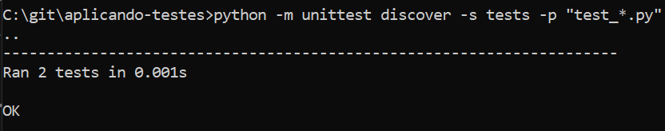
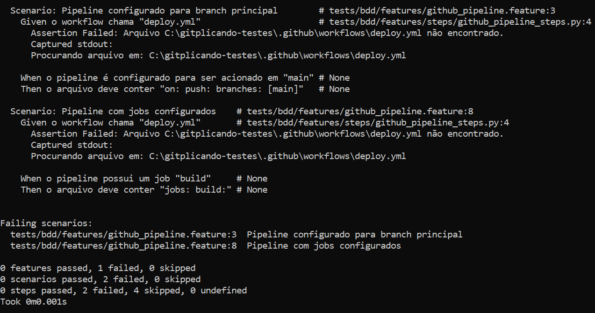

# Aplicando Testes

Este repositório tem como objetivo demonstrar a implementação de três tipos de testes: unitário, mock e BDD (Behavior-Driven Development), conforme os passos apresentados no tutorial de autoestudo. Cada tipo de teste foi implementado, testado e versionado no GitHub com commits específicos para cada etapa.

## Testes unitários

Os testes unitários têm o objetivo de testar unidades isoladas de código, como funções ou métodos, para garantir que eles se comportem conforme o esperado.

O teste unitário foi realizado para uma função simples que calcula pontos gerados por uma campanha.

Utilize o comando para executar os testes:

```cmd
python -m unittest discover -s tests -p "test_*.py"
```
No [arquivo](./tests/test_loyalty.py), existe um cenário de acerto e um de erro.

## Testes unitários

Os testes com Mock são utilizados para simular comportamentos de dependências externas (como APIs, bancos de dados ou serviços) para testar uma unidade de código sem depender desses componentes.

Utilize o comando para executar os testes:

```
python -m unittest discover -s tests -p "test_*.py"
```

No [arquivo](./tests/external_test.py), existe um cenário de chamada com valores reais e outro com zero.

## Testes BDD

Os testes BDD (Behavior-Driven Development) utilizam uma abordagem baseada no comportamento esperado do sistema. Os testes BDD descrevem o comportamento da aplicação em uma linguagem mais natural, utilizando as etapas Given, When e Then.

Utilize o comando para executar os testes:

```
python -m behave tests/bdd/features/
```

No [arquivo](./tests/bdd/features/steps/github_pipeline_steps.py), existem cenários definidos no [github_pipeline.feature](./tests/bdd/features/github_pipeline.feature) para verificar o [deploy.yml](./.github/workflows/deploy.yml).

## Evidências de execução:





<hr>
Atividade de programação baseada no artigo https://renatogroffe.medium.com/testes-de-software-com-net-5-exemplos-de-utiliza%C3%A7%C3%A3o-9b5514119ba2
